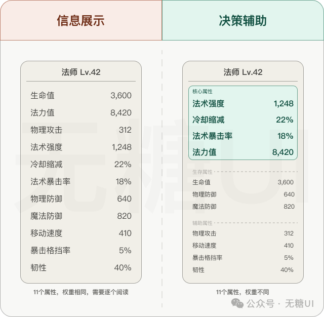

# UI与感知

UI一定程度上解决的是信息感知的问题
类似于桌游当中的图像，可以通过图示联系信息内容，让人可以快速反应这是什么内容，承载什么信息
但其中涉及到信息输出的程度，以及UI和谐程度，鉴于我是一个美术比较小白的人，这里只是为了探究借由 UI 进行信息传递的方法，所以也需要明确一下需要谈论 UI 的哪个方面

UI 是否好看是由美术风格以及视觉是否与界面和谐决定的，这方面我十分贫弱，所以需要将美术风格的部分内容手动抽离出来

## 美术风格

例如可以压低 UI 的整体对比度，降低显眼度，使得 UI 和场景色调更加融洽
也可以使用融合度更高的设计方式，参见游戏《死亡空间》，但这种设计太过困难

## 信息表达

参考资料当中主要提及两种信息获取方式

视觉读取：将信息列举在界面上，用户主动看向 UI 并理解其中内容
感知触发：减少信息密度，而是凸显信息变化，以提醒的方式让用户感知到，而无需用户的思考判断

在游戏中的简单例子就是属性面板和技能冷却
属性面板有多层分级，第一层是简单数值现实，方便快速浏览，这一层还能根据属性类别做简单的分类提高区分度

技能冷却则使用动效和音效强调可以直接感知的变化

在其他产品中感知触发的例子相对较少，视觉读取体现在各种信息流界面中。但感知触发则基本用于和实际用途相似的图标按钮隐藏的二级操作菜单，或是经常使用的工具（如扫一扫，相机，搜索，通知，设置）

可以根据不同的使用场景进行不同的 UI 设计逻辑
如果是反应和习惯优先——感知触发式；准确和理解优先——视觉读取式

## 参考内容

[无糖UI：为什么越好的游戏，越让你感觉不到UI的存在？](https://mp.weixin.qq.com/s/uJ3TYG0DF-3MDi2a1g-L5Q)